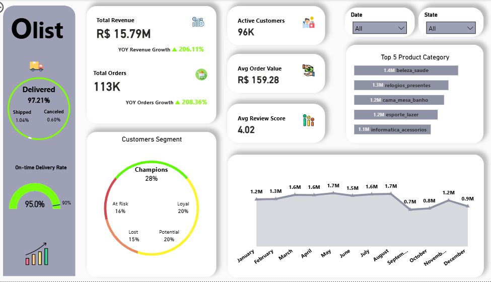

# Olist E-Commerce Analytics: End-to-End Data Pipeline

## Project Overview

A **complete data analytics pipeline** analyzing **100K+ orders** from Olist, Brazil's leading e-commerce marketplace (2016-2018). This project demonstrates full-stack analytics skills: from **raw data cleaning** (Python) to **relational modeling** (SQL) to **executive dashboards** (Power BI).

**Business Impact:**
- Identified **R$1M+ revenue** at risk from customer churn
- Delivered **207% YoY growth analysis** with seasonal insights
- Optimized **97.21% delivery rate** tracking for operational excellence

---

## Key Objectives

1. **Clean & Transform**: Process 8 raw CSV files into analysis-ready data
2. **Model & Engineer**: Build optimized relational schema with referential integrity
3. **Analyze & Segment**: Apply RFM methodology for customer behavioral insights
4. **Visualize & Recommend**: Create executive dashboard with actionable strategies

---

## Project Workflow

### **Data Exploration & Preprocessing (Python)**

**What was done:**
- Profiled **8 datasets** (~1M+ total rows) using automated EDA loop
- Converted **8 timestamp columns** from string to datetime format
- Identified critical issues:
  - Geolocation: 1M rows with severe duplication (same zip, multiple coordinates)
  - Orders: ~3% missing delivery dates
  - Products: ~610 missing categories
  - Reviews: 87% missing comment titles

**Strategic decisions:**
- Preserved null values for SQL-stage imputation (flexibility)
- Deferred geolocation aggregation to SQL (performance)
- Documented `customer_id` vs `customer_unique_id` distinction (retention analysis)

**Tools:** Python (Pandas, NumPy), VS Code, Jupyter Notebook

---

### **Data Engineering & Modeling (SQL)**

**What was done:**
- **Geolocation Optimization**: Aggregated 1M+ rows into `zipcode_locations` lookup table (averaged coordinates, most frequent city)
- **Referential Integrity**: Applied Primary/Foreign Key constraints across 8 tables
- **Orphan Handling**: Inserted missing zip codes, removed 7 invalid sellers
- **Denormalization**: Built `olist_flat_table` using **OUTER APPLY** to prevent row duplication from multiple payments/reviews
- **Gold Layer**: Created `olist_clean_for_powerbi` with:
  - Missing value imputation (COALESCE with global means)
  - Status flags (is_delivered, has_review)
  - Calculated columns (delivery_days_actual, total_order_item_value)

**Schema:** [View Database Diagram](https://dbdiagram.io/d/Olist_Database_Schema-694a881edbf05578e65ff0d1)

**Tools:** SQL Server (T-SQL)

---

### **Business Intelligence & Visualization (Power BI)**

**What was done:**

**Data Modeling:**
- Built **Date Table** with time intelligence hierarchy (Year, Quarter, Month, Week)
- Created **RFM Segmentation Table** with customer behavioral scoring
- Established relationships (Date ↔ Orders, RFM ↔ Customers)

**DAX Measures:**
- Core KPIs: Total Revenue, Orders, Customers, AOV, Review Score, Delivery Rate
- **Year-over-Year Growth**: 207% revenue increase, 208% orders increase
- Time Intelligence: MTD, QTD, YTD calculations

**Dashboard Design:**
- **Page 1 - Executive Summary**: 
  - 5 KPI cards with YoY growth indicators
  - Order status breakdown (97.21% delivered)
  - RFM customer segmentation (28% Champions, 16% At Risk)
  - Top 5 product categories (Health & Beauty leads at R$1.4M)
  - Monthly revenue trend (Jan 2017 - Dec 2018)

- **Page 2 - Strategic Insights**:
  - Revenue performance analysis (207% growth, seasonal patterns)
  - Customer loyalty strategy (At Risk = R$1M+ retention opportunity)
  - Operational excellence assessment (delivery vs. satisfaction gap)
  - AOV optimization recommendations (bundling strategies)

**Design Principles:**
- Color psychology (Green = positive, Red = negative)
- F-pattern layout for executive scanning
- <3 second load time via performance optimization

**Tools:** Power BI Desktop, DAX, Power Query

---

## Dashboard Preview



**Power BI Dashboard:**
- [Download .pbix File](https://drive.google.com/file/d/1FdCfOGbtMijKeajBIyd7dpqJaq_wSmzi/view?usp=drive_link)

---

## Key Business Insights

### **Revenue Performance**
- **207% YoY Growth**: Revenue surged from ~R$5.1M (2017) to R$15.79M (2018)
- **Seasonal Pattern**: Peak in August (R$1.7M), sharp drop in Q4 (requires investigation)
- **Order Volume**: 113K total orders (208% YoY increase)

### **Customer Segmentation (RFM Analysis)**
- **Champions (28%)**: Most valuable - high recency, frequency, monetary
- **Loyal Customers (20%)**: Consistent purchasers with strong retention
- **At Risk (16%)**: Declining engagement - **R$1M+ revenue at risk**
- **Lost (15%)**: Churned customers = R$2.4M+ in lost potential
- **Recommendation**: Target At Risk with retention campaigns (ROI: 5-7x cheaper than acquisition)

### **Operational Excellence**
- **Delivery Rate: 97.21%** - industry-leading logistics performance
- **Avg Review Score: 4.02/5** - solid but room for improvement
- **Gap Analysis**: High delivery rate but moderate satisfaction suggests quality/speed issues

### **Product & Revenue Optimization**
- **Average Order Value: R$159.59** (~40% higher than Brazilian e-commerce average)
- **Top Category**: Health & Beauty (R$1.4M - 9% of total revenue)
- **Opportunity**: Increase AOV to R$225 via bundling = **+R$2.5M annual revenue**

---

## Repository Structure
```
olist-ecommerce-analytics/
│── 01_docs/
│   ├── project_overview.md 
|   ├── data_dictionary.md      
|   ├── project_rodmap.pdf
|   └── stakeholders_analysis.pdf
|
├── 02_data/
│   ├── raw/                    # Original Kaggle CSVs (8 files)
│   ├── processed/              # Cleaned CSVs exported from Python
|   └── olist_flat_table.xlsx      
│
├── 03_python/
│   ├── data_exploration_and_cleaning.ipynb  
│   └── README.md
│   
├── 04_sql/
│   ├── database_relationships.md
│   ├── database_diagramm.png
│   └── query_and_analysis.sql          
│
├── 05_powerbi/
│   ├── olist_dashboard.pbix    
│   ├── 01_executive_summary.png
|   ├── 02_business_insights.png
|   └── README.md    
│
├── .gitignore
|
└── README.md
```

---

## Tech Stack

| Phase | Tools | Purpose |
|-------|-------|---------|
| **Data Cleaning** | Python, Pandas, NumPy | Type conversion, profiling, export |
| **Data Engineering** | SQL Server (T-SQL) | Aggregation, modeling, flat table |
| **Visualization** | Power BI, DAX, Power Query | Interactive dashboard, RFM segmentation |
| **Documentation** | Markdown, dbdiagram.io | Schema diagrams, project docs |

---

## Skills Demonstrated

**Python**: Data profiling, type correction, CSV processing  
**SQL**: Aggregation (GROUP BY, OUTER APPLY), constraints (PK/FK), CTEs, window functions  
**Power BI**: DAX measures, time intelligence, RFM segmentation, dashboard design  
**Data Modeling**: Star schema, denormalization, referential integrity  
**Business Analysis**: Customer segmentation, YoY growth, strategic recommendations  
**Documentation**: Professional README structure, data dictionaries  

---

## How to Reproduce

### **Prerequisites:**
- Python 3.12 (with Pandas, NumPy)
- SQL Server 2022
- Power BI Desktop (latest version)

### **Steps:**
1. **Clone repository**: `git clone https://github.com/ali-0128/olist-ecommerce-analytics`
2. **Run Python cleaning**: 
```bash
   cd 02_python
   jupyter notebook data_exploration_and_cleaning.ipynb
```
3. **Import to SQL Server**:
   - Create database: `CREATE DATABASE Olist_database;`
   - Import CSVs from `02_data/processed/`
   - Execute scripts in `04_sql/` sequentially
4. **Open Power BI**:
   - Connect to SQL Server
   - Open `05_powerbi/olist_dashboard.pbix`
   - Refresh data

---

## Author

**Ali Rabie**  
Data Analyst | Python • SQL • Power BI

- [LinkedIn](https://www.linkedin.com/in/ali-r-ba4086342/)
- [GitHub Portfolio](https://github.com/ali-0128)
- alirabie0128@gmail.com

---


*Last Updated: December 2025*
